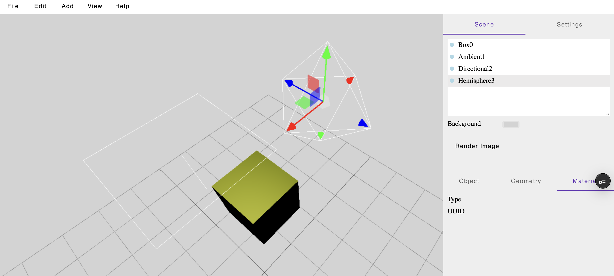

# 🎬 Szeneneditor

Ein interaktiver 3D-Szeneneditor – inspiriert vom offiziellen [Three.js Editor](https://threejs.org/editor/).  
Ermöglicht das Erstellen, Bearbeiten und Rendern komplexer 3D-Szenen direkt im Browser oder als Desktop-Anwendung.

---

## 📺 Demo

> 👉 **Live-Demo:** [Hier ausprobieren](https://szeneneditor.vercel.app)  
>   

---

## 🧱 Aufbau

Die Benutzeroberfläche und Funktionsweise orientieren sich am bekannten [Three.js Editor](https://threejs.org/editor/).  
Objekte können direkt in der Szene manipuliert, hinzugefügt und gelöscht werden.

---

## ⌨️ Tastenkombinationen

Zur effizienten Bearbeitung von Objekten gibt es folgende Shortcuts:

| Taste  | Funktion                       |
|--------|--------------------------------|
| `W`    | Verschieben (Translation)      |
| `E`    | Rotieren (Rotation)            |
| `R`    | Skalieren                      |
| `Entf` | Objekt aus Szene entfernen     |

---

## ✨ Funktionen

- ➕ Hinzufügen von **primitiven Objekten** (z. B. Cube, Sphere, Plane)
- 💡 Platzieren von **Lichtquellen** und **Kameras**
- 🖼️ Erstellen von **Renderings**
- 📂 **Import von 3D-Modellen** wie `.obj`, `.fbx` oder `.gltf`

---

## 🔭 Geplante Features

- ⚙️ **Physik-Simulationen** und dynamische Szenen
- 🎯 **Beispielszenen** zum schnellen Einstieg
- 🧩 **Individuell anpassbare Shortcuts**
- 🔌 **Integration in andere Programme** (z. B. CAD-Tools, Game Engines)

---

## 📦 Technologien

> Falls relevant, kannst du diesen Abschnitt ergänzen:

- Three.js
- WebGL / WebGPU
- Angular
- Drag-and-Drop UI Libraries

---

## 🛠️ Mitwirken

Pull Requests sind willkommen! Vorschläge für neue Features oder Bugfixes einfach im [Issue-Tracker](https://github.com/dein-projekt/issues) posten.

---

## 📄 Lizenz

MIT License – frei verwendbar für private und kommerzielle Zwecke.